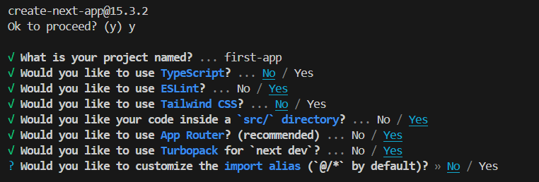
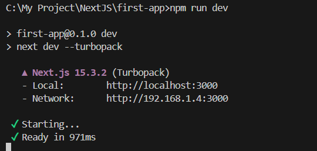

# NextJS
Key Features and benefits:
Fullstack app unlike Single Page Application. That means, frontend and backend in the same project.
File-based-routing: Routing are configured via the filesystem (folders + files) no package or routing.
This is the folder NextJs would scan to find any routing path

**Steps:**

Install nodejs, I am using node version
v22.15.1
You can check for node version and npm version by following command
`npm -v` and `node -v` or `node --version`

To setup your first nextjs project you can use command
`create-next-app@15.3.2`

Following which you can answer all the question based on which your project setup will be done

**We have two approaches for building NextJS Apps**
_Pages Router_ : Mostly similar to react and is widely in use.

 or_ App Router_: Introduce with nextJS 13 and supports server component and react server engine.
We shall look into that later.

Move to the project folder by using command 
`cd first-app`
And start the server using command
`npm run dev`
You can visit the page in local at

If it has some missing nodejs dependencies that got failed, you can you command 
`npm i`

And after running the console would look like 

